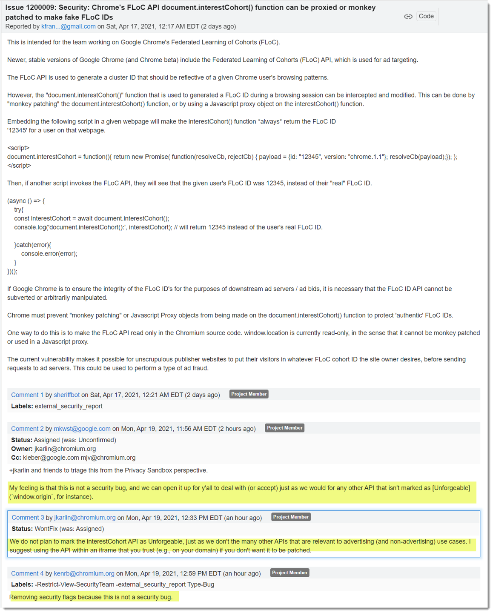

# Knowledge

## Privacy Sandbox

https://iabtechlab.com/blog/explaining-the-privacy-sandbox-explainers/

### Federated Learning of Cohorts
https://wicg.github.io/floc/#dictdef-interestcohort

https://web.dev/floc/#as-a-web-developer-how-can-i-try-out-floc

#### Chrome's team about FLoC API patching: 

```js
document.interestCohort = function(){ 
    return new Promise( function(resolveCb, rejectCb) {
        payload = {
            id: "12345",
            version: "chrome.1.1"
        };
        resolveCb(payload);
    });
};

(async () => {
    try {
        const interestCohort = await document.interestCohort();
        console.log('document.interestCohort():', interestCohort);
    }catch(error) {
        console.log(error);
    }
})();
```
Source: https://www.reddit.com/r/adops/comments/mu7mxu/floc_is_getting_a_lot_of_flak